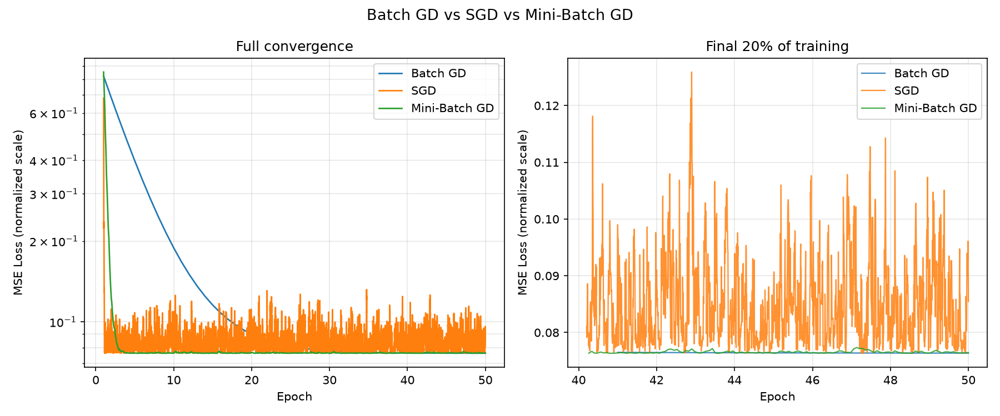

# Comparative Study of Batch GD, SGD, and Mini-Batch GD

A hands-on comparison of the three major Gradient Descent variants, implemented
from scratch on a simple **Linear Regression** problem (house area → house price)
and wrapped in an interactive Streamlit app.

## 📁 Project Structure

```
gd-project/
├── gradient_descent.py     # Dataset generation + all 3 GD algorithms (from scratch, numpy only)
├── experiment.py           # Runs the controlled comparison, saves plot + table
├── app.py                  # Streamlit UI (interactive version of the experiment)
├── requirements.txt
├── results/
│   ├── loss_vs_iterations.png
│   └── comparison_table.csv
└── README.md
```

## 🚀 How to Run

```bash
# 1. Install dependencies
pip install -r requirements.txt

# 2. Run the command-line experiment (prints table, saves plot + csv to results/)
python3 experiment.py

# 3. Or launch the interactive Streamlit app
streamlit run app.py
```

## 🧠 What's Being Compared

All three algorithms train the **same** Linear Regression model
(`price = w * area + b`) on the **same** dataset with the **same** MSE loss
function and the **same** starting parameters (`w=0, b=0`). The only thing
that differs is **how much data is used per parameter update**:

| Algorithm | Data used per update | Updates per epoch |
|---|---|---|
| **Batch GD** | Entire dataset | 1 |
| **SGD** | 1 random sample | n (dataset size) |
| **Mini-Batch GD** | Small batch (default 16) | n / batch_size |

## 📊 Sample Results (n=200, 50 epochs)

| Algorithm | Final Loss (MSE) | Updates | Training Time (s) |
|---|---|---|---|
| Batch GD | ~2.25 × 10⁸ | 50 | ~0.001 |
| SGD | ~2.27 × 10⁸ | 10,000 | ~0.23 |
| Mini-Batch GD | ~2.24 × 10⁸ | 650 | ~0.02 |

(Exact numbers vary run to run since data/shuffling is randomized — re-run
`experiment.py` to regenerate.)




## 🔍 Observations

- **Batch GD** converges the most **smoothly** — every update uses the true
  full-dataset gradient, so there's no noise. It's also the most
  computationally expensive **per update**, but here needs the fewest updates.
- **SGD** converges fast in terms of epochs but its loss curve is visibly
  **noisy/fluctuating** near the minimum, since each update is based on just
  one (possibly unrepresentative) sample.
- **Mini-Batch GD** sits in between: averaging the gradient over a small
  batch reduces the variance/noise compared to SGD, while still updating far
  more often than Batch GD — in practice, it's the standard choice for
  training most real ML models.

##  Quick Reference

**Q: Why does SGD look noisy?**
Because each update is based on the gradient of a single sample, which is a
noisy estimate of the true gradient over the whole dataset — good samples and
outlier samples both cause the parameters to jump around.

**Q: Why is Mini-Batch GD "a balance"?**
Averaging the gradient over `batch_size` samples reduces the variance of the
gradient estimate roughly by a factor of `batch_size` compared to SGD, while
still being far cheaper per update than using the whole dataset.

**Q: Why do we normalize the feature (x)?**
Gradient Descent converges much more reliably when features are on a similar
scale; house area (500–4000) vs an unscaled learning rate would otherwise
require an extremely small learning rate or could diverge.

**Q: What's the update rule?**
For `y = w*x + b` and MSE loss `L = (1/m) Σ (wx+b − y)²`:
```
dL/dw = (2/m) Σ (wx+b − y) * x
dL/db = (2/m) Σ (wx+b − y)
w := w − lr * dL/dw
b := b − lr * dL/db
```
`m` is the whole dataset for Batch GD, 1 for SGD, and `batch_size` for
Mini-Batch GD — that's the entire difference between the three algorithms.


## 🔮 Future Scope

- Extend to multivariate linear regression / logistic regression
- Add momentum, Adam, and other optimizers for a broader comparison
- Add a learning-rate scheduler and compare its effect on SGD's noise

# Gradient Descent Comparison

A comparative study and interactive implementation of **Batch Gradient Descent, Stochastic Gradient Descent (SGD), and Mini-Batch Gradient Descent** using a simple Linear Regression problem.

The project demonstrates how different Gradient Descent strategies affect the number of parameter updates, convergence behaviour, training time, and final Mean Squared Error (MSE).

---

## 📌 Project Overview

Gradient Descent is an optimization algorithm commonly used to minimize the loss function of machine learning models.

Although Batch Gradient Descent, Stochastic Gradient Descent, and Mini-Batch Gradient Descent all aim to minimize the same loss, they differ in how much training data is used for each parameter update.

In this project, all three methods are implemented from scratch and compared using the same Linear Regression problem.

### Problem Used

The project uses a simple house-price prediction problem:

**Input:** House Area (sq ft)  
**Target:** House Price

A synthetic dataset is generated using an approximately linear relationship:

```text
Price = 50 × Area + 50,000 + Noise
